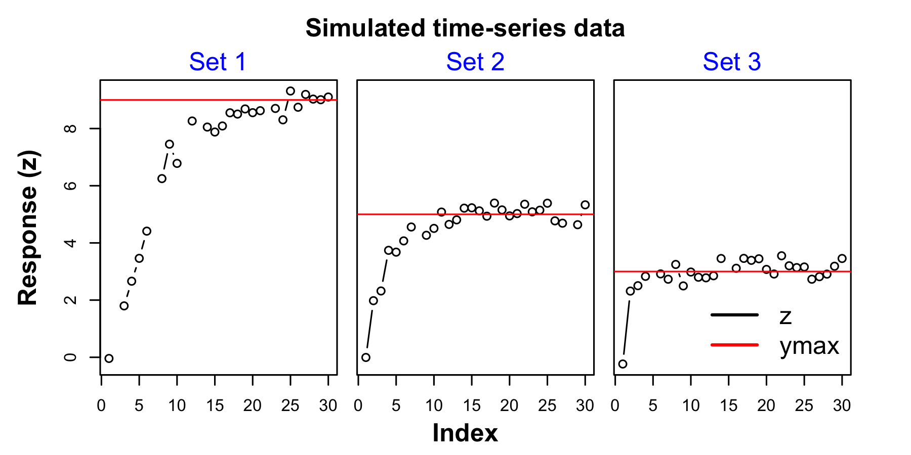
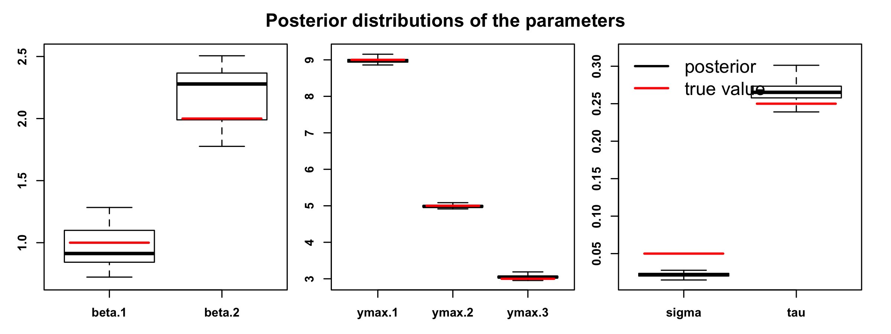
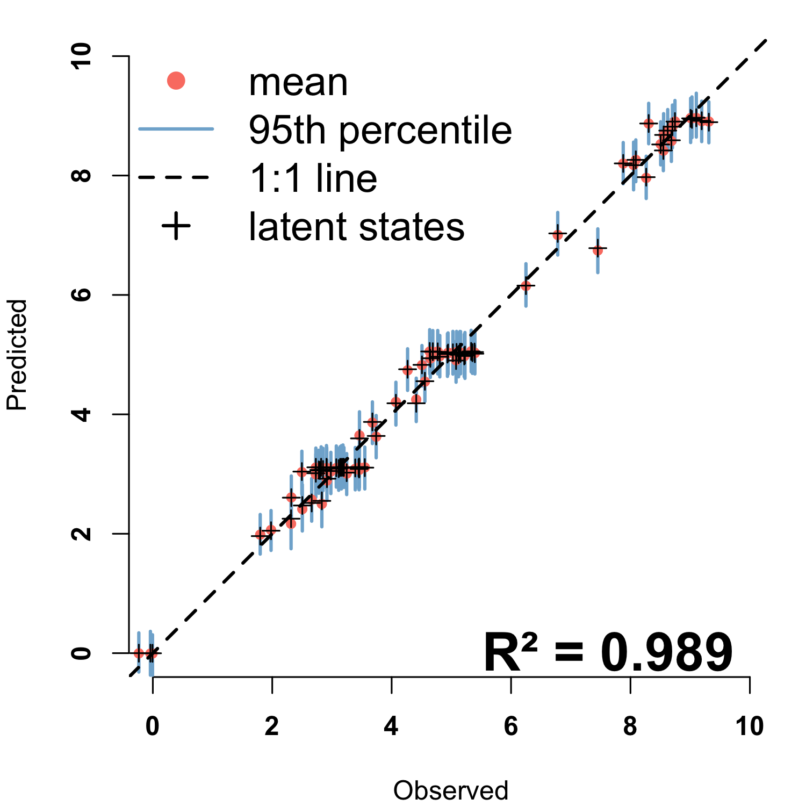

[](https://www.gnu.org/licenses/agpl-3.0) 
[](https://doi.org/10.5281/zenodo.1204614) 

[](https://www.tidyverse.org/lifecycle/#stable) 
[](https://travis-ci.org/bnasr/phenoCDM) 
[](https://codecov.io/github/bnasr/phenoCDM?branch=master) 

[](https://cran.r-project.org/package=phenoCDM) 
[](http://www.r-pkg.org/pkg/phenoCDM) 
[](http://www.r-pkg.org/pkg/phenoCDM) 


 
# phenoCDM: Continuous development models for incremental time-series analysis: applications on leaf phenology


## Installation
The phenoCDM package can be directly installed from the CRAN:

```{r, echo=TRUE}

install.packages("phenoCDM", repos = "http://cran.us.r-project.org")

```

## Example

Loading the package:
```{r, echo=TRUE}

library(phenoCDM)

```


Simulating a dataset of three time-series:
```{r, echo=TRUE}

set.seed(2)

ssSim <- phenoSim(nSites = 3, #number of sites
                  nTSet = 30, #number of time steps
                  beta = c(1, 2), #beta coefficients
                  sig = 0.05, #process error
                  tau = 0.25, #observation error
                  plotFlag = F, #whether plot the data or not
                  miss = 0.1, #portion of missing data
                  ymax = c(9,5, 3) #maximum of saturation trajectory
)


```

Plotting the simulated time-series:

```{r, echo=TRUE, fig.height=3, fig.width=6}


ww1 <- which(is.na( ssSim$connect[,1]))
ww2 <- which(is.na( ssSim$connect[,2]))

par(mfrow = c(1,3), oma = c(4,4,4,3), mar=c(0,1,0,0))
for(i in 1:length(ww1))  {
  z <- ssSim$z[ww1[i]:ww2[i]]
  ymax <- ssSim$ymax[i]
  plot(z, xlab = 'Index', ylab = '', type = 'b', ylim = range(c(0, ymax, ssSim$z), na.rm = T), yaxt= switch(i, '1'='s', '2'='n', '3' = 'n'))
  mtext(paste('Set', i), side = 3, line = .3, col = 'blue', font=1)
  abline(h = ymax, col='red')
}

mtext(text = 'Response (z)', side = 2, line = 2, outer = T, font = 2)
mtext(text = 'Index', side = 1, line = 2.5, outer = T, font = 2)
mtext('Simulated time-series data', side = 3, outer = T, line = 1.5, font = 2)
legend('bottomright', legend = c('z', 'ymax'), col = c('black', 'red'), lty = 1, bty = 'n', cex=1.5, lwd =2)


```




Fitting the CDM model on the simulated data:
```{r, echo=TRUE}

ssOut <- fitCDM(x = ssSim$x, #predictors
                nGibbs = 2000,
                nBurnin = 1000,
                z = ssSim$z,#response
                connect = ssSim$connect, #connectivity of time data
                quiet=T,
                calcLatentGibbs = T)
```


Obtaining the summarized output:
```{r, echo=TRUE}

summ <- getGibbsSummary(ssOut, burnin = 1000, sigmaPerSeason = F)

colMeans(summ$ymax)
colMeans(summ$betas)
colMeans(summ$tau)
colMeans(summ$sigma)

```


Comparing the model fitted parameters agaist true values:
```{r, echo=TRUE, fig.width = 8, fig.height = 3}

par(mfrow = c(1,3), oma = c(1,1,3,1), mar=c(2,2,0,1), font.axis=2)

plotPost(chains = ssOut$chains[,c("beta.1", "beta.2")], trueValues = ssSim$beta)
plotPost(chains = ssOut$chains[,c("ymax.1", "ymax.2", "ymax.3")], trueValues = ssSim$ymax)
plotPost(chains = ssOut$chains[,c("sigma", "tau")], trueValues = c(ssSim$sig, ssSim$tau))
mtext('Posterior distributions of the parameters', side = 3, outer = T, line = 1, font = 2)
legend('topleft', legend = c('posterior', 'true value'), col = c('black', 'red'), lty = 1, bty = 'n', cex=1.5, lwd =2)


```




Comparing the model fitted parameters agaist true values:
```{r, echo=TRUE, fig.width = 5, fig.height = 5}


yGibbs <- ssOut$latentGibbs
zGibbs <- ssOut$zpred
o <- ssOut$data$z
p <- apply(ssOut$rawsamples$y, 1, mean)
R2 <- cor(na.omit(cbind(o, p)))[1,2]^2

par( mar=c(4,4,1,1), font.axis=2)
plotPOGibbs(o = o , p = zGibbs,
            xlim = c(0,10), ylim=c(0,10),
            cex = .7, nburnin = 1000)
points(o, p, pch = 3)
mtext(paste0('R² = ', signif(R2, 3)), line = -1, cex = 2, font = 2, side = 1, adj = .9)
legend('topleft', legend = c('mean', '95th percentile', '1:1 line', 'latent states'),
       col = c('#fb8072','#80b1d3','black', 'black'),
       bty = 'n', cex=1.5,
       lty = c(NA, 1, 2, NA), lwd =c(NA, 2, 2, 2), pch = c(16, NA, NA, 3))


```


