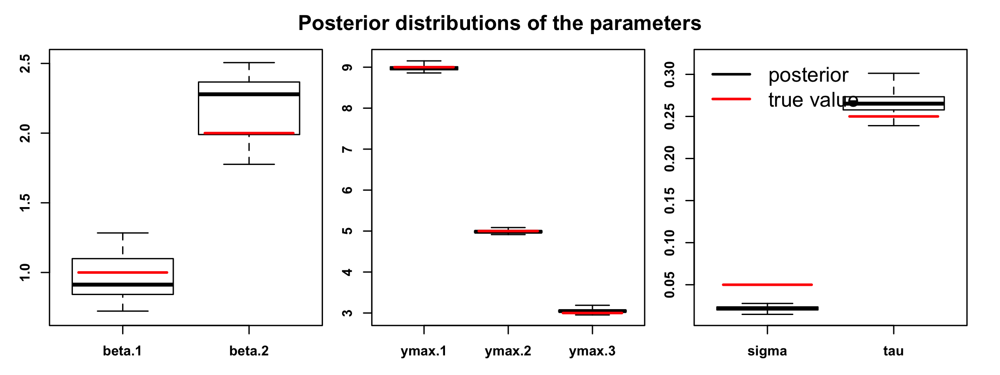
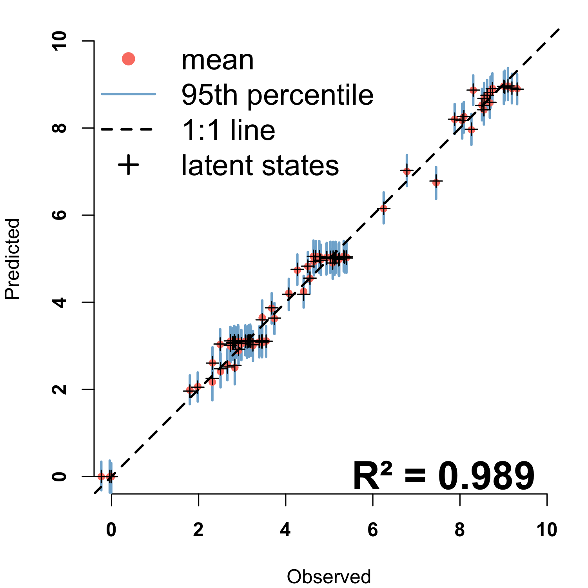

---
output:
  pdf_document: default
  html_document: default
---
# phenoCDM
Continuous development models for incremental time-series analysis: applications on leaf phenology


## Installation
The phenoCDM package can be directly installed from the Github source:

```{r, echo=TRUE}

install_github("bnasr/phenoCDM")

```

## Example

Loading the package:
```{r, echo=TRUE}

library(phenoCDM)

```


Simulating a dataset of three time-series:
```{r, echo=TRUE}

set.seed(2)

ssSim <- phenoSim(nSites = 3, #number of sites
                  nTSet = 30, #number of time steps
                  beta = c(1, 2), #beta coefficients
                  sig = 0.01, #process error
                  tau = 0.1, #observation error
                  plotFlag = F, #whether plot the data or not
                  miss = 0.1, #fraction of missing data
                  ymax = c(9,5, 3) #maximum of saturation trajectory)

```

Plotting the simulated time-series:

```{r, echo=TRUE}

ww1 <- which(is.na( ssSim$connect[,1]))
ww2 <- which(is.na( ssSim$connect[,2]))

png('fig1.png', width = 6, height = 3, units = 'in', res = 300)

par(mfrow = c(1,3), oma = c(3,2,1,1), mar=c(2,2,0,1))

for(i in 1:length(ww1))  {
  z <- ssSim$z[ww1[i]:ww2[i]]
  ymax <- ssSim$ymax[i]
  plot(z, xlab = 'Index', ylab = '', type = 'b', ylim = range(c(0, ymax, z), na.rm = T))
  mtext(paste('Set', i), side = 1, line = -2, col = 'blue', font=2)
  abline(h = ymax, col='red')
}

mtext(text = 'Response (z)', side = 2, line = 0.5, outer = T, font = 2)
mtext(text = 'Index', side = 1, line = 0.5, outer = T, font = 2)

dev.off()

```

[!Figure 1. Simulated data](fig1.png)


Fitting the CDM model on the simulated data:
```{r, echo=TRUE}

ssOut <- fitCDM(x = ssSim$x, #predictors  
                nGibbs = 2000,
                nBurnin = 1000,
                z = ssSim$z,#response
                connect = ssSim$connect, #connectivity of time data
                quiet=T)

```


Obtaining the summarized output:
```{r, echo=TRUE}

summ <- getGibbsSummary(ssOut, burnin = 1000, sigmaPerSeason = F)

colMeans(summ$ymax)
colMeans(summ$betas)
colMeans(summ$tau)
colMeans(summ$sigma)

```


Comparing the model fitted parameters agaist true values:
```{r, echo=TRUE}

png('fig2.png', width = 8, height = 3, units = 'in', res = 300)

par(mfrow = c(1,3), oma = c(1,1,1,1), mar=c(2,2,0,1), font.axis=2)

plotPost(chains = ssOut$chains[,c("beta.1", "beta.2")], trueValues = ssSim$beta)
plotPost(chains = ssOut$chains[,c("ymax.1", "ymax.2", "ymax.3")], trueValues = ssSim$ymax)
plotPost(chains = ssOut$chains[,c("sigma", "tau")], trueValues = c(ssSim$sig, ssSim$tau))

dev.off()

```




Comparing the model fitted parameters agaist true values:
```{r, echo=TRUE}


yGibbs <- t(apply(ssOut$rawsamples$y, 1:2, mean))
o <- ssOut$data$z
p <- apply(ssOut$rawsamples$y, 1, mean)
R2 <- cor(na.omit(cbind(o, p)))[1,2]^2


png('fig3.png', width = 5, height = 5, units = 'in', res = 300)
par( mar=c(4,4,1,1), font.axis=2)

plotPOGibbs(o = o , p = yGibbs, xlim = c(0,10), ylim=c(0,10), cex = .7)
mtext(paste0('R² = ', signif(R2, 3)), line = -1, cex = 2, font = 2, side = 1, adj = .9)
legend('topleft', legend = c('predictions', '95th percentile', '1:1 line'),
       col = c('#fb8072','#80b1d3','black'),bty = 'n', cex=1.5,
       lty = c(NA, 1, 2), lwd =c(NA, 2, 2), pch = c(16, NA, NA))

dev.off()

```


